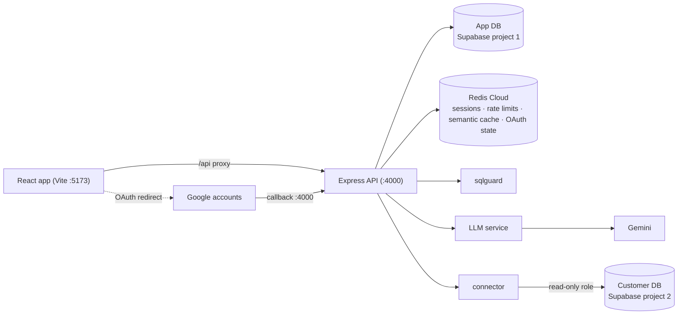

# QueryLens

Ask your PostgreSQL database questions in plain English. An LLM writes the SQL — and the system treats that SQL as hostile input: it is parsed with PostgreSQL's own parser, checked against a safety allowlist, row-capped, and executed inside a read-only transaction with a statement timeout.

**Phase 2 (current):** multi-user accounts (email/password + optional Google OAuth), per-user data-source isolation, Redis sessions with refresh-token rotation, sliding-window rate limits, and a semantic cache so paraphrased questions can reuse prior SQL without another LLM call.



## What you get

| Area | Details |
|---|---|
| Natural language → SQL | Gemini (`gemini-3.5-flash` by default) via Vercel AI SDK |
| Safety | `libpg-query` AST checks + `BEGIN READ ONLY` + statement timeout + row `LIMIT` |
| Auth | Register / login, Argon2 passwords, Google OAuth, in-memory access JWT + httpOnly refresh cookie |
| Isolation | Every data source and ask is scoped by `user_id` |
| Redis | Session store, login lockout counters, Lua rate limiter (20 asks/min), OAuth CSRF `state`, vector semantic cache |
| UI | Connect databases, browse schema, ask questions, edit/re-run SQL, table + chart results |

## How a question flows

1. `POST /api/ask` (authenticated, rate-limited to 20/min per user) loads the stored schema snapshot for a data source *owned by the caller*.
2. The semantic cache is checked first: an exact hash match, then a Redis `FT.SEARCH` KNN over question embeddings, filtered by user id and schema checksum. A close-enough hit (cosine distance ≤ `SEMCACHE_MAX_DISTANCE`, default `0.1`) reuses the cached SQL and skips the LLM. On a miss, the LLM receives the schema plus the question and returns a single `SELECT`; successful answers are cached for a week.
3. **sqlguard** validates it with `libpg-query` (the real PostgreSQL parser compiled to WASM):
   - `E_PARSE` — must parse
   - `E_MULTI_STATEMENT` — exactly one statement (`SELECT 1; DROP TABLE ...` dies here)
   - `E_NOT_SELECT` — top-level node must be `SelectStmt`
   - `E_FORBIDDEN_NODE` — no DML/DDL anywhere in the tree (catches `WITH x AS (DELETE ...)`), no `SELECT INTO`, no `FOR UPDATE`, no `pg_sleep` / `pg_read_file` / `dblink` / etc.
   - a `LIMIT 1000` row cap is added when the query has none
4. The query runs on the customer database inside `BEGIN READ ONLY` with a 10s `statement_timeout`, connected as a `SELECT`-only role — so even a validator bug cannot write.
5. Rows stream back to the UI as a table (and a bar chart when the shape fits), and the outcome is logged to an audit table (`cache_hit` recorded when the semantic cache answered).

Hand-edited SQL (`POST /api/run`) goes through the exact same guard — safety is a property of the server, not a filter on LLM output.

## Setup

Requires Node 22+, two free [Supabase](https://supabase.com) projects, and a free [Redis Cloud](https://redis.io/try-free) database.

### 1. Create the Supabase projects (or any Postgres)

This repo’s default setup uses two free Supabase projects for convenience — they are **not** required for the databases you query through the UI:

- `querylens-app` — the application's own database (users, data sources, messages, schema snapshots). Any Postgres URL works in `APP_DATABASE_URL`.
- `querylens-demo` — optional sample customer DB for `npm run seed:demo`. Skip this if you’ll only connect your own Postgres.

For Supabase, copy the **Session pooler** connection string (Connect → Session pooler, port 5432). Do not use the direct `db.<ref>.supabase.co` host — it is IPv6-only on the free tier and fails on most home networks.

Then create a free 30MB Redis Cloud database (the default includes the query engine needed for vector search) and copy its public endpoint and `default` user password.

### 2. Configure the environment

```bash
cp .env.example .env
```

Fill in:

| Variable | What it is |
|---|---|
| `APP_DATABASE_URL` | Session-pooler URL of `querylens-app` |
| `DEMO_ADMIN_URL` | Session-pooler URL of `querylens-demo` |
| `DEMO_RO_PASSWORD` | Password the seed script gives the read-only role |
| `ENCRYPTION_KEY` | 64 hex chars — `node -e "console.log(require('node:crypto').randomBytes(32).toString('hex'))"` |
| `GOOGLE_GENERATIVE_AI_API_KEY` | Free key from [Google AI Studio](https://aistudio.google.com/apikey) |
| `LLM_MODEL` | Default `gemini-3.5-flash` |
| `LLM_THINKING_BUDGET` | Default `0` (cheaper SQL generation on Gemini 3.x) |
| `REDIS_URL` | `redis://default:<password>@<host>:<port>` from Redis Cloud |
| `JWT_SECRET` | 64 hex chars (same generator as `ENCRYPTION_KEY`) |
| `ACCESS_TOKEN_TTL` | Default `15m` |
| `GOOGLE_CLIENT_ID` / `GOOGLE_CLIENT_SECRET` | Optional. OAuth 2.0 Web client from [Google Cloud Console](https://console.cloud.google.com/apis/credentials) |
| `GOOGLE_REDIRECT_URI` | Default `http://localhost:4000/api/auth/google/callback` |
| `WEB_ORIGIN` | Default `http://localhost:5173` (post-OAuth redirect target) |
| `EMBEDDING_MODEL` / `SEMCACHE_MAX_DISTANCE` | Semantic cache tuning |
| `DEMO_DATA_SOURCE_ID` | Optional. Data source id served by the public no-login demo at `/demo` |
| `PORT` | API port (default `4000`) |

**Google OAuth (optional)** — in the Cloud Console Web client set:

- Authorized JavaScript origins: `http://localhost:5173`
- Authorized redirect URIs: `http://localhost:4000/api/auth/google/callback`

Without these vars, email/password auth still works; the “Continue with Google” button stays hidden.

### 3. Install, migrate, seed, run

```bash
npm install
npm run migrate      # 001 init → 002 auth → 003 google_oauth
npm run seed:demo    # creates + fills the e-commerce demo schema in querylens-demo
npm run dev          # API on :4000, web on :5173
```

### 4. Create an account

Open http://localhost:5173 — you’ll land on **Register** / **Login** (or **Continue with Google** if configured). The first account automatically adopts any data sources created before auth existed.

## Connect your PostgreSQL database

**Your data database does not have to be on Supabase.** QueryLens connects to any reachable Postgres (Neon, RDS, Railway, a VPS, Docker on localhost, Supabase, etc.) via host / port / database / user / password.

1. Sign in → **Data sources** → **Add Connection** (or **Connect a database**).
2. Fill in:
   - **Host**, **Port** (usually `5432`), **Database**
   - **Username** / **Password**
   - **SSL**: `require` for most hosted DBs; `disable` for local Postgres on the same machine as the API
3. Save — the API **tests** the connection first, then encrypts credentials at rest (AES-256-GCM).
4. Click **Refresh** to introspect the schema (tables + columns).
5. Open **Query** and ask in plain English.

### Recommendations

- Prefer a **read-only** Postgres role (`SELECT` only). QueryLens also runs every query inside `BEGIN READ ONLY` with a statement timeout, but a RO user is still the best last line of defense.
- The **API process** must be able to reach the host (cloud firewall / IP allowlist). Localhost DBs only work when the API runs on that same machine (`npm run dev` does).
- For providers that expose both a direct host and a pooler, use whichever is reachable from your network (on Supabase free tier, prefer the **session pooler**).

### Optional: wire up the seeded demo DB

If you ran `npm run seed:demo` against `querylens-demo`, connect with:

- Host / port / database: from the `querylens-demo` session-pooler string
- Username: `querylens_ro.<project-ref>` (pooler usernames are `role.project-ref`)
- Password: your `DEMO_RO_PASSWORD`

Then ask something like *"top 5 products by revenue"*.

> If the `querylens_ro` login is rejected by the pooler, connect with the `postgres.<project-ref>` admin user as a temporary fallback — the read-only transaction still prevents writes — and prefer fixing the role login when possible.

## Public demo mode (no login)

Visitors can try QueryLens against the seeded demo database without an account at **`/demo`**.

- Enable it by setting `DEMO_DATA_SOURCE_ID` in `.env` to the id of a `data_sources` row (the seeded demo DB is usually id `1`). Leave it unset to disable the demo entirely.
- The demo path (`/api/demo/*`) applies the exact same safety pipeline as authenticated queries — sqlguard AST validation, `BEGIN READ ONLY`, statement timeout, read-only DB role — plus a stricter per-IP rate limit (6 questions/min).
- Demo questions share one semantic cache under a `demo` tag, so common questions cost zero LLM calls.
- Demo activity is logged to `messages` with a `NULL` user id.

## Scripts

| Command | Purpose |
|---|---|
| `npm run dev` | API + web together |
| `npm run dev:api` / `npm run dev:web` | Run one side only |
| `npm run migrate` | Apply SQL migrations to the app DB |
| `npm run seed:demo` | Reset + seed the demo customer DB |
| `npm test` | sqlguard adversarial test suite |

## Project layout

```text
apps/
├─ api/            Express 5, plain JS (ESM)
│  └─ src/
│     ├─ db/           pool, migrations (001–003), seed, repositories
│     ├─ redis/        client, key registry, Lua sliding-window rate limiter
│     ├─ routes/       health, auth, data-sources, ask/run
│     ├─ middleware/   requireAuth, errorHandler
│     ├─ services/
│     │  ├─ auth/      JWT access tokens, refresh rotation, Google OAuth
│     │  ├─ connector/ test / introspect / execute (read-only)
│     │  ├─ llm/       prompt builder + Gemini via Vercel AI SDK
│     │  ├─ semcache/  Gemini embeddings + Redis vector search cache
│     │  └─ sqlguard/  AST validation with libpg-query
│     └─ lib/          AES-256-GCM credential encryption
└─ web/            Vite + React 19, Tailwind 4, Recharts
   └─ src/
      ├─ context/      AuthContext (access token in memory, refresh on load)
      ├─ pages/        Login, Register, AuthCallback, Sources, AddSource, Ask
      └─ components/   SchemaSidebar, ResultTable, ResultChart, GoogleSignInButton
```

## API surface (auth-gated unless noted)

| Method | Path | Notes |
|---|---|---|
| `GET` | `/api/health` | Public |
| `GET` | `/api/auth/providers` | `{ google: true/false }` |
| `POST` | `/api/auth/register` | Email + password |
| `POST` | `/api/auth/login` | Sets refresh cookie |
| `GET` | `/api/auth/google` | Starts OAuth redirect |
| `GET` | `/api/auth/google/callback` | Exchanges code, sets cookie, redirects to web |
| `POST` | `/api/auth/refresh` | Rotates refresh token → new access JWT |
| `POST` | `/api/auth/logout` | Revokes session |
| `GET` | `/api/auth/me` | Current user |
| `*` | `/api/data-sources…` | CRUD / test / introspect (per user) |
| `POST` | `/api/ask` | NL → SQL → execute |
| `POST` | `/api/run` | Hand-edited SQL → same guard → execute |

## How auth works

- **Access token**: 15-minute HS256 JWT, held only in browser memory (never a cookie, never localStorage), sent as `Authorization: Bearer`.
- **Refresh token**: opaque random value in an `httpOnly` cookie scoped to `/api/auth`. Stored in Redis as a sha256 hash, grouped into a rotation *family*.
- **Rotation + replay detection**: every refresh invalidates the old token and issues a new one in the same family. If an already-used token is presented again — the signature of a stolen cookie — the entire family is revoked and every session from it dies.
- **Google OAuth**: authorization-code flow with Redis-backed CSRF `state`. The ID token is verified against Google's JWKS (`jose`); accounts link by verified email if one already exists. Same refresh-cookie session model as password login.
- **Lockout**: 5 failed logins per email trigger a 15-minute lock (Redis counter with TTL). Google-only accounts (no password) get a clear error if password login is attempted.
- **Isolation**: every data-source query is scoped by `user_id` in SQL, and semantic-cache lookups filter on the user id tag inside the vector search itself.

## Roadmap (phase 3)

- Workspaces + RBAC (shared data sources, admin/analyst roles)
- Guard upgrades: relation allowlist from the schema snapshot, `EXPLAIN` cost gate
- SSE streaming responses, job queue on Redis Streams, scheduled reports
