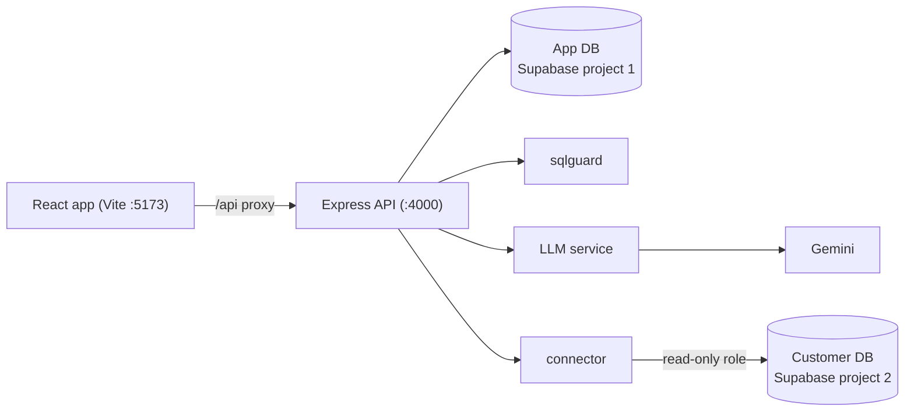

# QueryLens

Ask your PostgreSQL database questions in plain English. An LLM writes the SQL — and the system treats that SQL as hostile input: it is parsed with PostgreSQL's own parser, checked against a safety allowlist, row-capped, and executed inside a read-only transaction with a statement timeout.



## How a question flows

1. `POST /api/ask` loads the stored schema snapshot for the data source.
2. The LLM receives the schema plus the question and returns a single SELECT.
3. **sqlguard** validates it with `libpg-query` (the real PostgreSQL parser compiled to WASM):
   - `E_PARSE` — must parse
   - `E_MULTI_STATEMENT` — exactly one statement (`SELECT 1; DROP TABLE ...` dies here)
   - `E_NOT_SELECT` — top-level node must be `SelectStmt`
   - `E_FORBIDDEN_NODE` — no DML/DDL anywhere in the tree (catches `WITH x AS (DELETE ...)`), no `SELECT INTO`, no `FOR UPDATE`, no `pg_sleep` / `pg_read_file` / `dblink` / etc.
   - a `LIMIT 1000` row cap is added when the query has none
4. The query runs on the customer database inside `BEGIN READ ONLY` with a 10s `statement_timeout`, connected as a `SELECT`-only role — so even a validator bug cannot write.
5. Rows stream back to the UI as a table (and a bar chart when the shape fits), and the outcome is logged to an audit table.

Hand-edited SQL (`POST /api/run`) goes through the exact same guard — safety is a property of the server, not a filter on LLM output.

## Setup

Requires Node 22+ and two free [Supabase](https://supabase.com) projects.

### 1. Create the Supabase projects

- `querylens-app` — the application's own database
- `querylens-demo` — stands in for a customer database

For each, copy the **Session pooler** connection string (Connect → Session pooler, port 5432). Do not use the direct `db.<ref>.supabase.co` host — it is IPv6-only on the free tier and fails on most home networks.

### 2. Configure the environment

```bash
cp .env.example .env
```

Fill in:

| Variable | What it is |
|---|---|
| `APP_DATABASE_URL` | Session-pooler URL of `querylens-app` |
| `DEMO_ADMIN_URL` | Session-pooler URL of `querylens-demo` |
| `DEMO_RO_PASSWORD` | Password the seed script gives the read-only role |
| `ENCRYPTION_KEY` | 64 hex chars — `node -e "console.log(require('node:crypto').randomBytes(32).toString('hex'))"` |
| `GOOGLE_GENERATIVE_AI_API_KEY` | Free key from [Google AI Studio](https://aistudio.google.com/apikey) |

### 3. Install, migrate, seed, run

```bash
npm install
npm run migrate      # creates app tables in querylens-app
npm run seed:demo    # creates + fills the e-commerce demo schema in querylens-demo
npm run dev          # API on :4000, web on :5173
```

### 4. Register the demo database in the UI

Open http://localhost:5173, click **Connect a database**, and enter:

- Host / port / database: from the `querylens-demo` session-pooler string
- Username: `querylens_ro.<project-ref>` (pooler usernames are `role.project-ref`)
- Password: your `DEMO_RO_PASSWORD`

Then ask something like *"top 5 products by revenue"*.

> If the `querylens_ro` login is rejected by the pooler, connect with the `postgres.<project-ref>` admin user as a temporary fallback — the read-only transaction still prevents writes — and prefer fixing the role login when possible, since the dedicated role is the last line of defense.

## Scripts

| Command | Purpose |
|---|---|
| `npm run dev` | API + web together |
| `npm run migrate` | Apply SQL migrations to the app DB |
| `npm run seed:demo` | Reset + seed the demo customer DB |
| `npm test` | sqlguard adversarial test suite |

## Project layout

```text
apps/
├─ api/            Express 5, plain JS (ESM)
│  └─ src/
│     ├─ db/           pool, migrations, seed, repositories
│     ├─ routes/       health, data-sources, ask/run
│     ├─ services/
│     │  ├─ connector/ test / introspect / execute (read-only)
│     │  ├─ llm/       prompt builder + Gemini via Vercel AI SDK
│     │  └─ sqlguard/  AST validation with libpg-query
│     └─ lib/          AES-256-GCM credential encryption
└─ web/            Vite + React 19, Tailwind, Recharts
```

## Roadmap (phase 2)

- Auth: JWT access tokens + refresh rotation with replay detection, workspaces, RBAC
- Redis: semantic answer cache, rate limiting, session store, job queue (Streams)
- Guard upgrades: relation allowlist from the schema snapshot, `EXPLAIN` cost gate
- SSE streaming responses and scheduled reports
