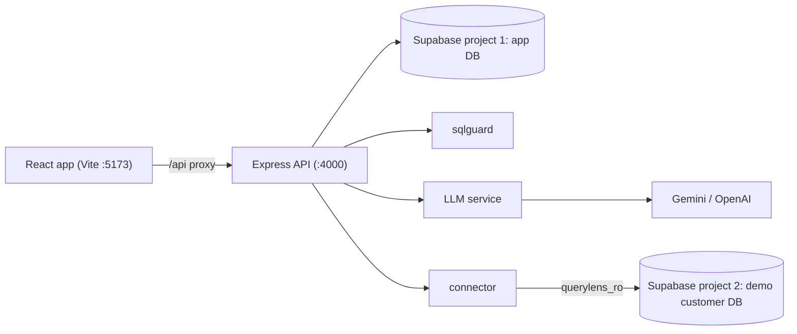
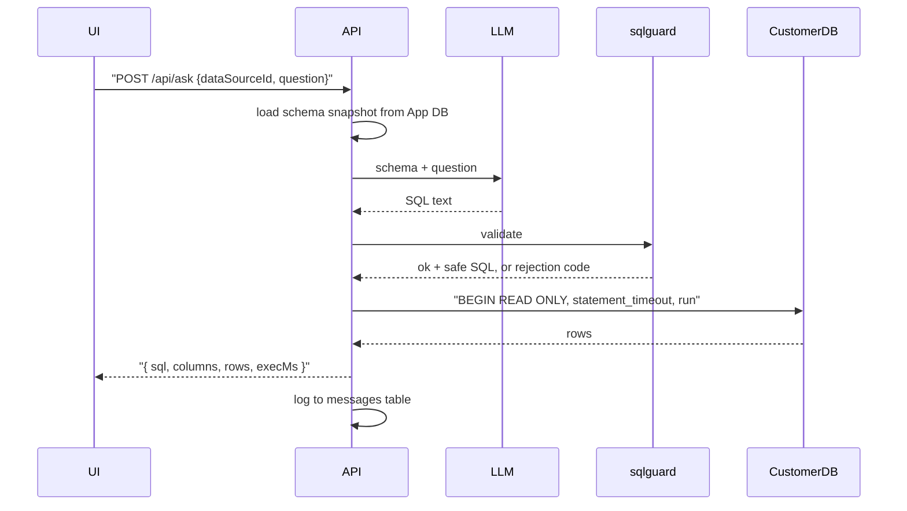

_Note: This plan was created before the work began and may not reflect the final state of the codebase._

# QueryLens v0 Foundation

Goal for this phase: one working path end to end. Connect a database, introspect its schema, ask a question in English, see the generated SQL and a table of results. Redis, auth, workspaces, and background workers come in phase 2.

## Stack

- Frontend: Vite + React 19, plain `.jsx`, React Router, Tailwind, Recharts
- Backend: Express 5, plain JS ESM (`"type": "module"`), Node 22
- Databases: two Supabase projects (app database and demo customer database), accessed with the raw `pg` driver and raw SQL migrations. No ORM and no `supabase-js`, so the SQL stays visible and portable.
- SQL validation: `libpg-query` (real Postgres parser compiled to WASM)
- LLM: `ai` (Vercel AI SDK) with a provider adapter, default Google Gemini since it has a free tier; switching to OpenAI is a two-line change
- Tests: built-in `node:test`, no test framework dependency

Deliberately skipped in v0: Redis, JWT/auth, workspaces and RBAC, Streams workers, semantic cache, SSE streaming, row-level security.

## Architecture



Ask flow:



## Repo layout

```text
querylens/
├─ package.json                 npm workspaces: apps/*
├─ .env.example
├─ apps/
│  ├─ api/
│  │  └─ src/
│  │     ├─ server.js  config.js
│  │     ├─ db/        pool.js, migrate.js, migrations/*.sql, seed/demo.sql, repos/
│  │     ├─ routes/    health.js, dataSources.js, ask.js
│  │     ├─ services/
│  │     │  ├─ connector/  testConnection.js, introspect.js, execute.js
│  │     │  ├─ llm/        prompt.js, generateSql.js
│  │     │  └─ sqlguard/   index.js, rules.js
│  │     ├─ lib/       crypto.js  (AES-256-GCM for stored passwords)
│  │     └─ middleware/ errorHandler.js
│  └─ web/
│     └─ src/  pages/{Sources,AddSource,Ask}.jsx, components/, lib/api.js
└─ README.md
```

## App database schema (v0)

Three tables in `001_init.sql`:

- `data_sources` — id, name, host, port, database, username, `password_ciphertext`/`iv`/`auth_tag`, ssl_mode, last_introspected_at
- `schema_snapshots` — id, data_source_id, `tables jsonb`, checksum, captured_at
- `messages` — id, data_source_id, question, generated_sql, status, rejection_code, row_count, exec_ms, created_at

Migration runner is a ~40 line script that applies `migrations/*.sql` in filename order and records applied names in a `_migrations` table.

## Supabase setup

Two free-tier Supabase projects, which is exactly the free-tier allowance:

- Project 1, `querylens-app` — the application database (migrations run here)
- Project 2, `querylens-demo` — stands in for a customer's database

Connection rules that matter:

- Use the **shared pooler in session mode**: `postgresql://postgres.<project-ref>:<password>@aws-<region>.pooler.supabase.com:5432/postgres`. The direct host `db.<ref>.supabase.co:5432` is IPv6-only on free tier and will fail on most IPv4 home and CI networks. Session mode also keeps full Postgres feature parity, unlike transaction mode on 6543.
- `pg` needs TLS enabled: append `?sslmode=require` and configure `ssl: { rejectUnauthorized: false }` in the pool options.
- Keep pool sizes small (`max: 5`) since free tier connection limits are modest.

Environment variables in `.env`:

- `APP_DATABASE_URL` — project 1, used by the API and the migration runner
- `DEMO_ADMIN_URL` — project 2 as `postgres`, used only by the seed script
- `DEMO_RO_URL` — project 2 as `querylens_ro`, the connection registered as a data source in the UI

Known free-tier caveat to note in the README: projects pause after roughly 7 days of inactivity and need a manual restore from the dashboard. Fine during development; if the deployed demo needs to stay reachable long-term, moving the app database to Neon (auto-wakes in about half a second) is a one-line `APP_DATABASE_URL` change with no code impact.

## Demo customer database

`db/seed/demo.sql` creates a small e-commerce schema (`regions`, `customers`, `products`, `orders`, `order_items`) populated with a few thousand rows via `generate_series` — enough for realistic joins and aggregations, and comfortably inside the 500 MB free-tier limit. An `npm run seed:demo` script applies it over `DEMO_ADMIN_URL` so the setup is reproducible from the repo rather than clicked together in the dashboard.

The same script creates the read-only role:

```sql
CREATE ROLE querylens_ro LOGIN PASSWORD '...';
GRANT USAGE ON SCHEMA public TO querylens_ro;
GRANT SELECT ON ALL TABLES IN SCHEMA public TO querylens_ro;
ALTER DEFAULT PRIVILEGES IN SCHEMA public GRANT SELECT ON TABLES TO querylens_ro;
```

One thing to verify early during implementation: Supavisor expects the username in `<role>.<project-ref>` form, so the read-only login becomes `querylens_ro.<project-ref>`. If a custom role cannot authenticate through the pooler, the fallback is to connect as `postgres` for v0 and rely on the guard's `BEGIN READ ONLY` transaction, then revisit the dedicated role. This is worth resolving properly, since the read-only role is the last line of defense in the safety story.

## SQL guard gates for v0

Each gate returns a stable error code:

1. `E_PARSE` — `libpg-query` fails to parse
2. `E_MULTI_STATEMENT` — more than one statement
3. `E_NOT_SELECT` — top-level node is not `SelectStmt`
4. `E_FORBIDDEN_NODE` — AST walk rejects data-modifying CTEs (`WITH x AS (DELETE ...)`), `SELECT INTO`, locking clauses, and calls to `pg_sleep` / `pg_read_file` / `dblink` / `lo_import`
5. Row cap — if no `limitCount` in the AST, wrap as `SELECT * FROM (<sql>) AS _q LIMIT 1000`. Wrapping avoids needing a deparse step and stays correct across `UNION`.
6. Execution guard — `BEGIN READ ONLY` with `SET LOCAL statement_timeout = '10s'`, connecting as the read-only role

Deferred to phase 2: relation allowlist checking against the schema snapshot, and the `EXPLAIN`-based cost gate.

`POST /api/run` (user-edited SQL) goes through the identical guard, since it is a property of the server, not a filter on LLM output.

## API surface

- `GET /api/health` — pings app DB
- `GET/POST /api/data-sources` — POST tests the connection before encrypting and saving
- `POST /api/data-sources/:id/introspect` — reads `information_schema`, stores a snapshot
- `GET /api/data-sources/:id/schema`
- `DELETE /api/data-sources/:id`
- `POST /api/ask` — `{dataSourceId, question}` returns `{sql, columns, rows, execMs}` or a rejection code
- `POST /api/run` — `{dataSourceId, sql}`, same guard and response shape

## Frontend pages

- Sources list, plus an Add Source form that shows connection-test success or failure inline
- Ask page: schema sidebar, question input, generated SQL in a read-only editor with a Run button, results table, and a chart when the result shape suits one (one text column plus one numeric column)

## Before starting

Two things are needed in `.env` before the app can run end to end:

1. Two Supabase projects created, with their session-pooler connection strings copied into `APP_DATABASE_URL` and `DEMO_ADMIN_URL`.
2. An LLM API key. The plan defaults to `GOOGLE_GENERATIVE_AI_API_KEY` with Gemini's free tier; switching to OpenAI means installing `@ai-sdk/openai` and changing one line in `generateSql.js`.

Everything up to the LLM service (scaffold, migrations, seed, crypto, connector, sqlguard) can be built and tested without an API key, so setup can happen in parallel with the first several todos.